# AREP---Parcial2-
##Verbo Julian Camacho Villamarin
# bitacora
## Primera parte crear la aplicación web
1) Cree un proyecto java usando maven.
2) Cree la clase principal
   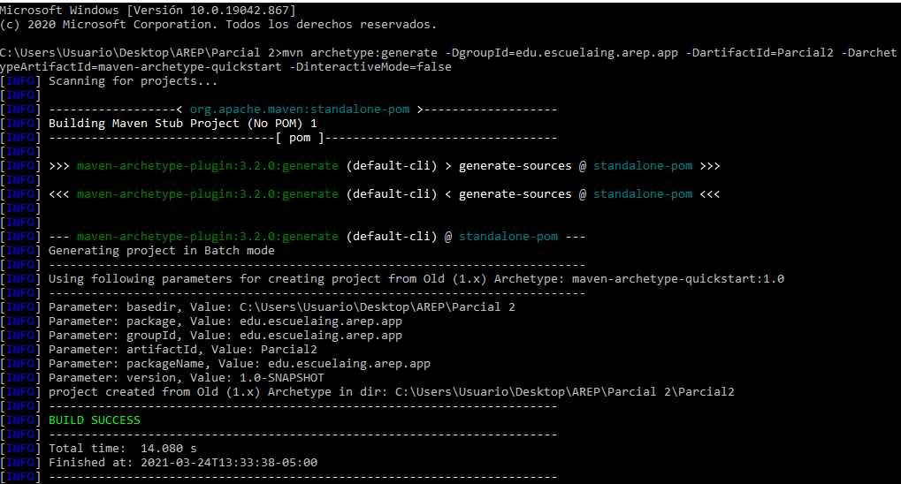
   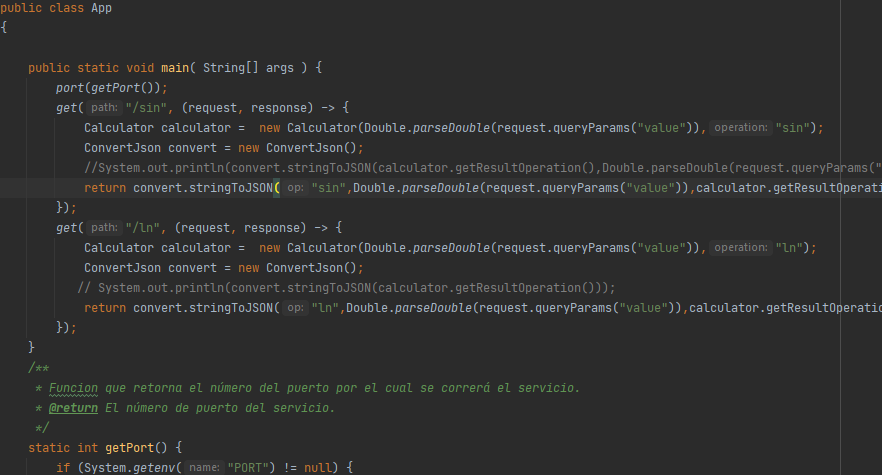
## Segunda Parte: crear imagen para docker y subirla

#### Conectamos a la consola de aws
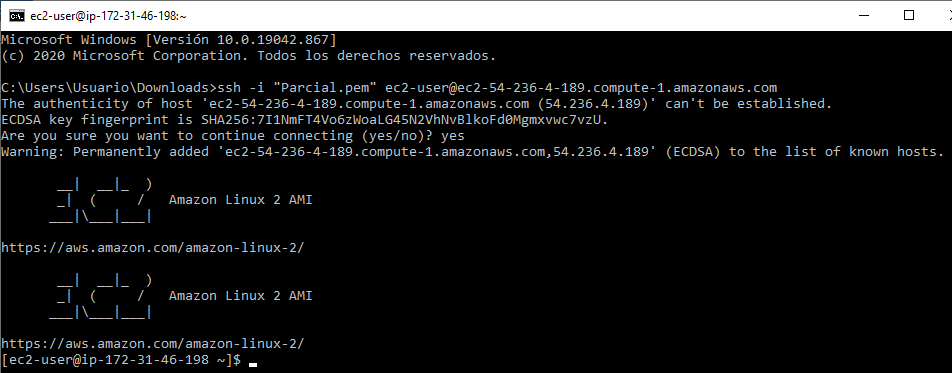

#### Nos aseguramos que este funcionando en localhost 4567

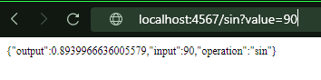

#### realizamos el montaje de la imagen en docker
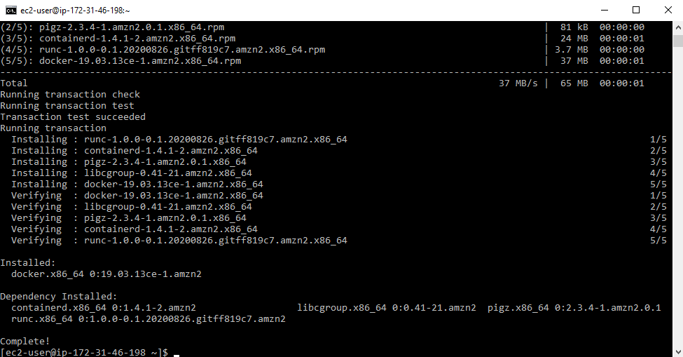

#### Utilizamos el siguiente comando docker build --tag dockersparkprimer .
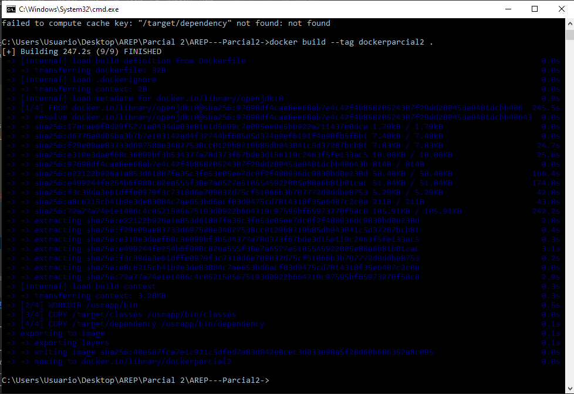

#### Verificamos que docker tenga las images creadas correctamente
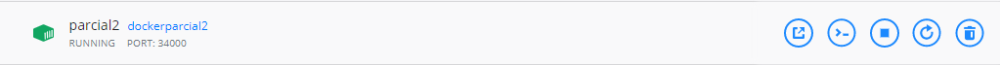
#### Realizamos el push
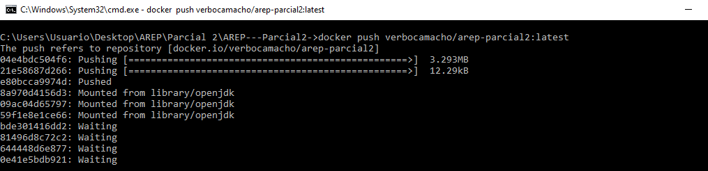

#### Realizamos el pull en la maquina aws

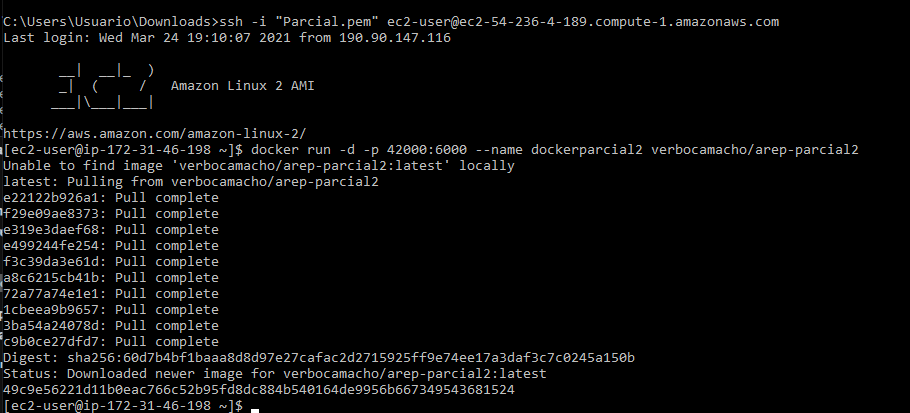
#### Modificamos el grupo de seguridad para poder ingresar mediante el puerto 42000
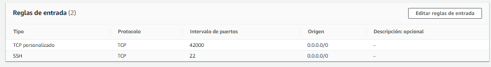

### Probamos el funcionamiento de la funcion sin
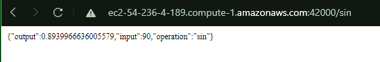
#### Probamos el funcionamiento de la funcion ln
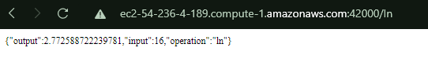
### En las siguientes imagenes se visualiza correctamente la estructura del link que se solicito en el parcial

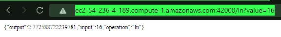

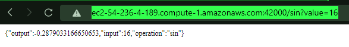

## Link video
[Video](https://drive.google.com/file/d/1w9_mzioELnVRqEUA_q6mxk9sMqrofOAf/view?usp=sharing)
# Autor
Verbo Julian Camacho Villamarin

# Licencia

Este proyecto está licenciado bajo la licencia General Public License v3.0, revise el archivo [LICENSE](LICENSE.txt) para más información.